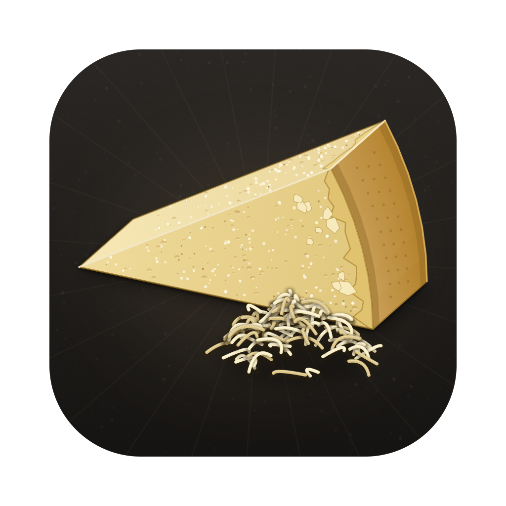
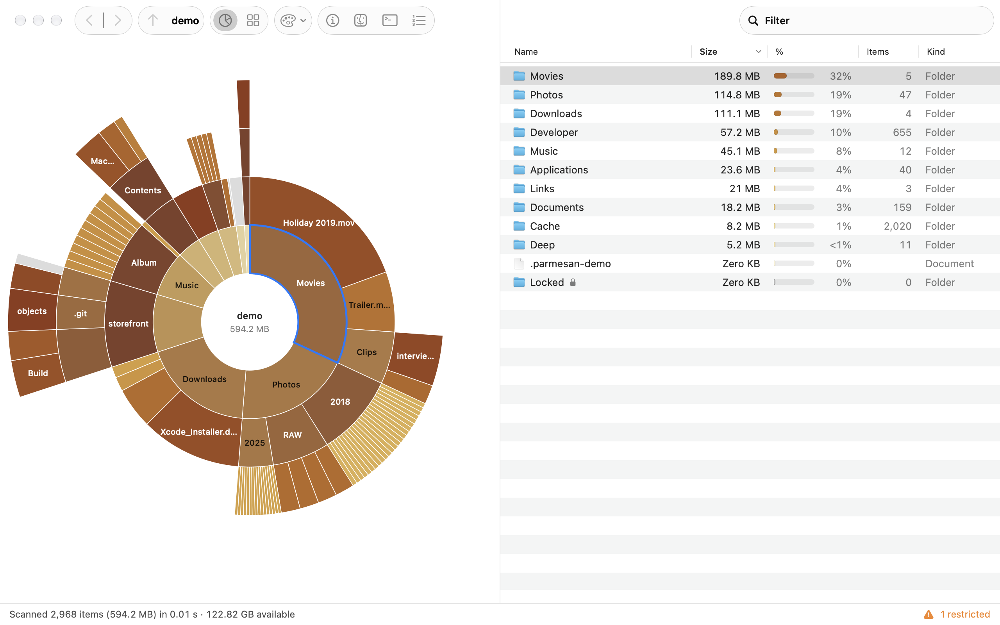
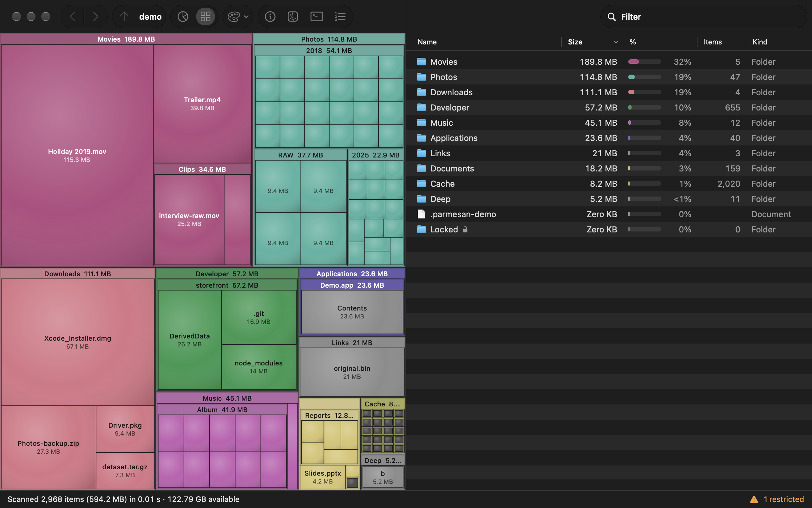
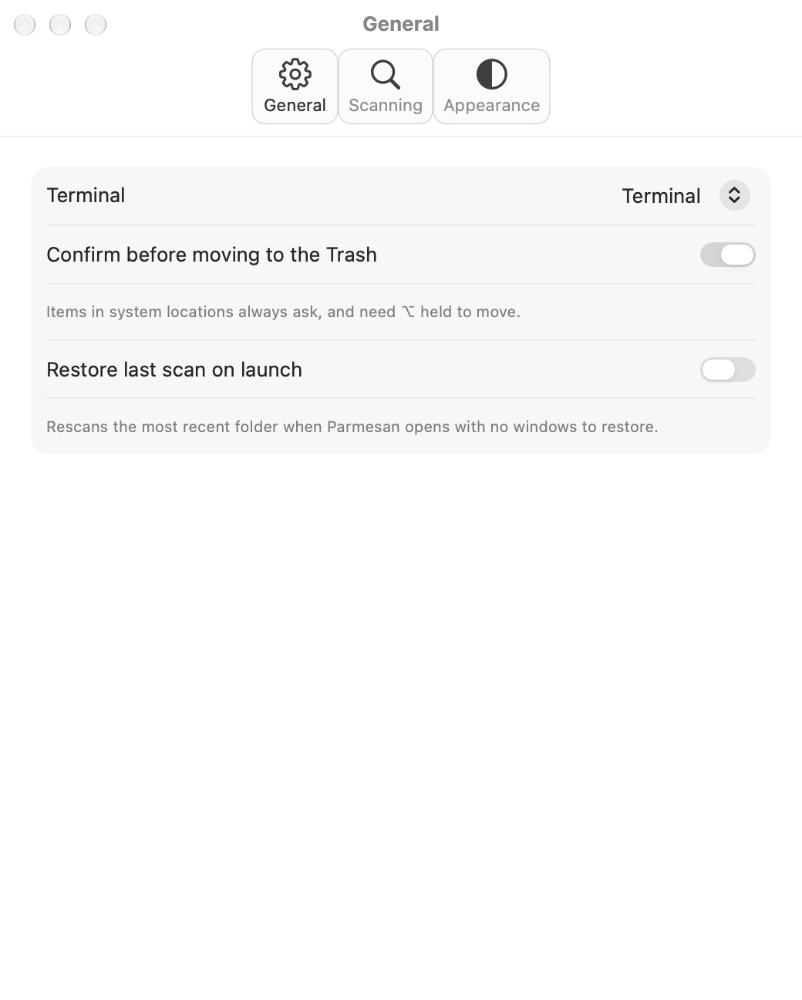
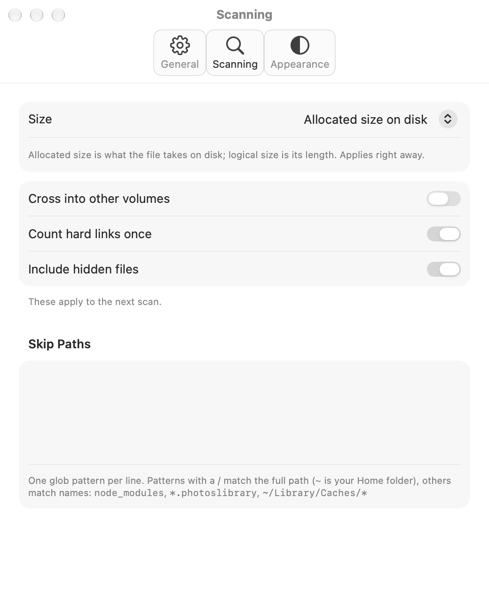
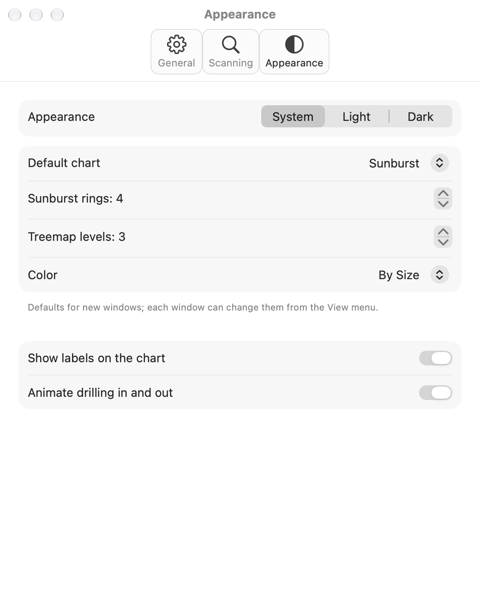

<p align="center">
  
</p>
<h1 align="center">Parmesan</h1>

A native macOS disk usage analyzer. Parmesan scans a folder or a whole volume, works out how much space every folder and file takes, and shows it as a color-coded sunburst or treemap next to a sortable table. Drill into any folder, and jump straight to it in Finder or Terminal. It runs locally only: no App Store, no notarization, no Apple Developer account, no network access at all. Build it yourself.

See the [user manual](MANUAL.md) for everything the app can do.

## Requirements

- macOS 15 or later
- Xcode (to build)
- [XcodeGen](https://github.com/yonaskolb/XcodeGen), which generates the Xcode project from `project.yml`

## Build

On a fresh Xcode install, first run the following. Installing Xcode doesn't make it the active developer directory: until you switch it, `xcodebuild` fails with "requires Xcode, but active developer directory ... is a command line tools instance". Homebrew and `xcodebuild` also refuse to run until the license is accepted.

```sh
sudo xcode-select -s /Applications/Xcode.app/Contents/Developer
sudo xcodebuild -license accept
xcodebuild -runFirstLaunch
```

Then build:

```sh
brew install xcodegen
xcodegen generate
xcodebuild -scheme Parmesan -configuration Release -derivedDataPath build build
```

The app is written to `build/Build/Products/Release/Parmesan.app`. To work in Xcode instead, run `open Parmesan.xcodeproj`. Signing is "Sign to Run Locally" (no team needed).

`Parmesan.xcodeproj` is generated and gitignored. Re-run `xcodegen generate` after adding or removing source files, or after editing `project.yml`.

`./build.sh` does all of the above in one go and installs the app (see below).

## Install

```sh
ditto build/Build/Products/Release/Parmesan.app /Applications/Parmesan.app
```

To update, quit Parmesan, rebuild, and run the same command again. Your settings are kept.

## Full Disk Access

macOS keeps some folders private (Mail, Messages, Safari, other apps' containers, parts of `~/Library`). Without Full Disk Access, Parmesan can't look inside them: they show as **Restricted** (a lock in the table, gray hatching in the chart) and their size is left out of the totals. Parmesan only reads names and sizes, never file contents.

To grant it, open **System Settings → Privacy & Security → Full Disk Access**, turn on Parmesan (or click **+** and choose `/Applications/Parmesan.app`), then rescan. Parmesan offers to open that pane on first launch, and from **Help → Grant Full Disk Access…**.

**Rebuilding resets it.** macOS ties the grant to the app's code signature, and an ad-hoc ("Sign to Run Locally") signature changes with every build. After rebuilding, either:

- remove the old Parmesan entry in the Full Disk Access list and add the new build (fine for occasional updates), or
- sign with a **stable local identity**, so the grant survives rebuilds:

  ```sh
  SIGN_IDENTITY="Apple Development: you@example.com" ./build.sh
  ```

  A free "Apple Development" certificate comes from Xcode → Settings → Accounts with any Apple ID. A self-signed code-signing certificate made in Keychain Access → Certificate Assistant → Create a Certificate (type "Code Signing") works too; pass its name.

## Test

```sh
xcodebuild -scheme Parmesan test
```

The scanner and model tests build throwaway folder trees in a temp directory and check totals (including against `du -sk`), hard-link dedupe, symlinks, restricted folders, skip patterns, rescans and cancellation. Layout tests check the sunburst and treemap engines.

Testing also builds a Debug copy of the app, which you can launch to try a change without a Release build or install. It goes to Xcode's DerivedData folder, whose path differs per machine; `xcodebuild` prints it:

```sh
open "$(xcodebuild -scheme Parmesan -showBuildSettings 2>/dev/null | awk -F' = ' '/ BUILT_PRODUCTS_DIR /{print $2}')/Parmesan.app"
```

Quit any other copy of Parmesan first: both share an app ID, so `open` may just bring the running one to the front. The Debug copy uses the same settings.

The app also has a command-line mode for benchmarking the scanner against `du`. It prints the totals, the time taken and the largest folders, then exits:

```sh
build/Build/Products/Release/Parmesan.app/Contents/MacOS/Parmesan --scan ~ --top 20
du -sk ~
```

Options: `--logical` (logical instead of allocated sizes), `--cross-volumes`, `--threads N`.

## Demo tree

```sh
scripts/make-demo.sh
```

This builds a folder tree in `demo/` (gitignored) that shows every state Parmesan draws: a few hundred MB of real data with a clear biggest chunk and a long tail, thousands of tiny files (grouped as "N smaller items"), deep nesting, a `node_modules`-like tree, a fake `.app` package, files of every By Kind category, old and new modification dates, a hard-link pair (counted once), a symlink to a big folder (not followed) and a restricted (`chmod 000`) folder. It prints the expected total to check against the app and `du -sk demo`. It's handy for screenshots. Drop the `demo` folder on Parmesan's window to scan it. Running the script again rebuilds it from scratch (and restores the restricted folder's permissions first).

## App icon

The icon art is in `Design/`. The SVGs are generated by `Design/icon.py` (Python 3, standard library only); edit that and regenerate everything with:

```sh
python3 Design/icon.py
sips -s format png Design/AppIcon.svg --out Design/AppIcon-1024.png
sips -s format png Design/AppIcon-small.svg --out Design/AppIcon-small.png
scripts/make-icons.sh
```

`AppIcon-small.svg` is simplified art for 16 and 32 px. All outputs, including the asset catalog's `AppIcon.appiconset`, are checked in, so building the app doesn't need Python. The script is seeded, so re-running it on an unchanged `icon.py` produces no diff.

## Good to know

- **Where settings live:** `UserDefaults` under the app ID `com.breadthe.Parmesan`, including recent scans (as bookmarks).
- **App Sandbox is off,** because the sandbox would stop Parmesan from reading the whole file system.
- **Sizes are allocated size on disk** by default (what `du` reports). Switch to logical size in Settings → Scanning.
- **Hard links are counted once** per scan. Symlinks are never followed.
- **APFS clones and snapshots** share blocks that can't be cheaply attributed to one file, so totals can exceed the space actually used on the volume.
- **Scanning `/`** counts the System and Data volumes once each: folders reached through firmlinks (`/Users`, `/Applications`, …) aren't counted again under `/System/Volumes/Data`. Other mounted volumes aren't entered unless you turn that on in Settings → Scanning.
- **Move to Trash is the only destructive action,** and it never deletes: items go to the Trash and can be put back from Finder. It asks first (unless you turn that off), and items in system locations need ⌥ held.
- **Get Info** asks Finder to show its Info window. The first time, macOS asks whether Parmesan may control Finder; you can change that later in System Settings → Privacy & Security → Automation.
- **No network access, no analytics.** Scan data never leaves your Mac.

## Screenshots

**Light mode**

<picture>
  
</picture>

**Dark mode**

<picture>
  
</picture>

| General | Scanning |
|---|---|
|  |  |
| **Appearance** | |
|  | |

## License

[MIT](LICENSE)
